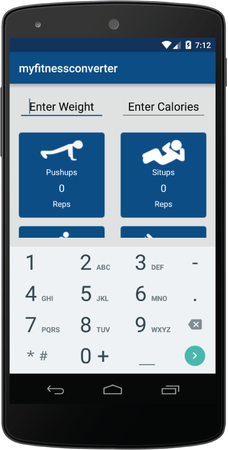
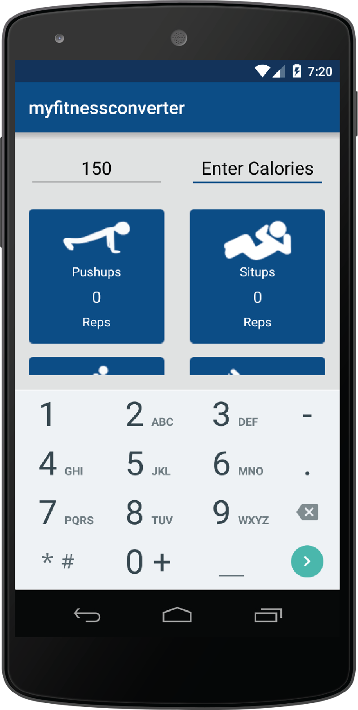
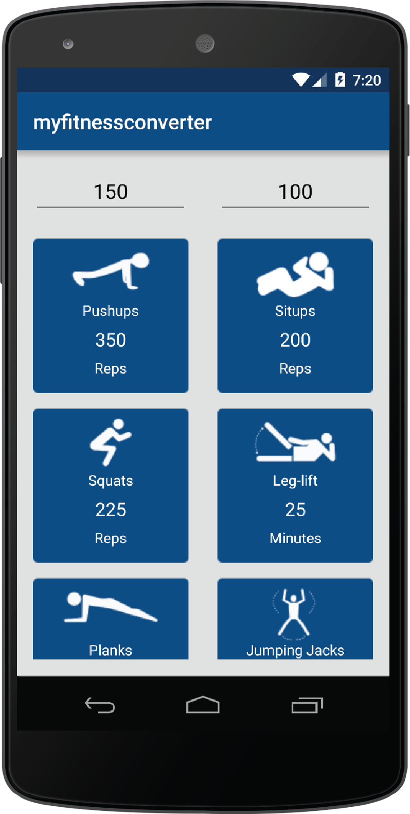
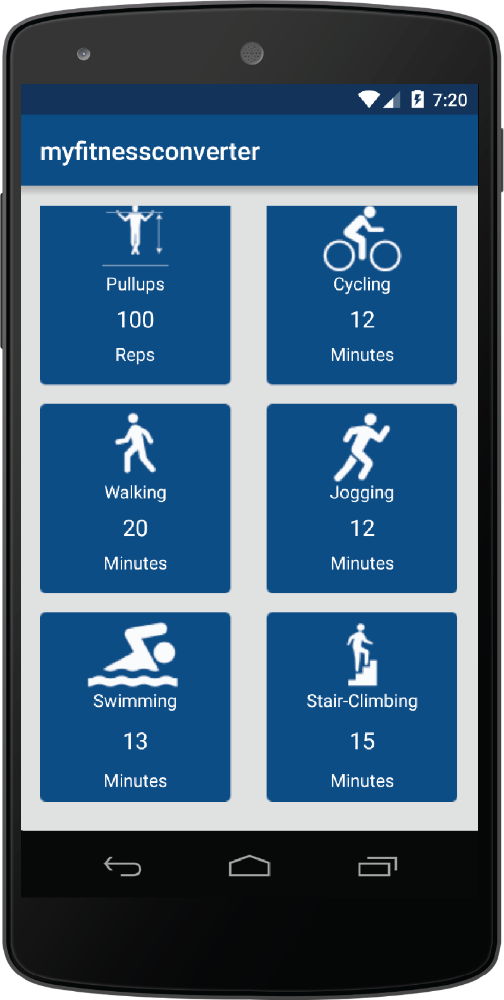
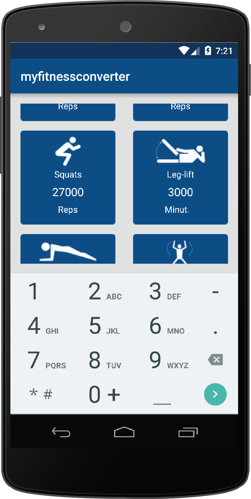

# PROG 01: Crunch Time

This is MyFitnessConverter. MyFitnessConverter is an android app that lets you convert calories to the number of reps or minutes for 12 different exercise. You can also convert from one exercise to another and see how many calories it is.

Using MyFitnessConverter is very easy. 
1. Start by typing in your weight. If you don’t type in anything, the app defaults to 150 lb. 
2. Enter the amount of calories you want to burn.
3. Scroll down to see how many reps or minutes of a particular exercise you have to do in order to burn that amount of calories.
4. Alternatively, you can also enter the amount of reps or minutes you did or will do and see how many calories you will burn. You can also see the number of reps or minutes of one exercise converted to another exercise.
Note: when you enter a weight, make sure to type something into calories (if it’s the same number, delete a digit and readd it) so it will recalculate everything.

## Authors

Simon Cao ([scsmncao@berkeley.edu](mailto:scsmncao@berkeley.edu))

## Demo Video

See [MyFitnessConverter] (https://www.youtube.com/watch?v=W4mJ75DP2R8)

## Screenshots

## Acknowledgments

All icons were found on Noun Project. Here are the awknowledgments for every icon.

pushup icon - Tyler Glaude
situp icon - mcarranza
squat icon - Blaise Sewell
leg-lift icon - Co-Effect Creative
plank icon - Claire Jones
jumping jacks icon - Jasper Reyes
pullups icon - Demograph
cycling icon - National Park Service Collection
walking icon - irene hoffman
jogging icon - Desbenoit
swimming icon - National Park Service Collection
stair climbing icon - Sol Resonante Amarillo
logo cycle arrow icon - artworkbean

